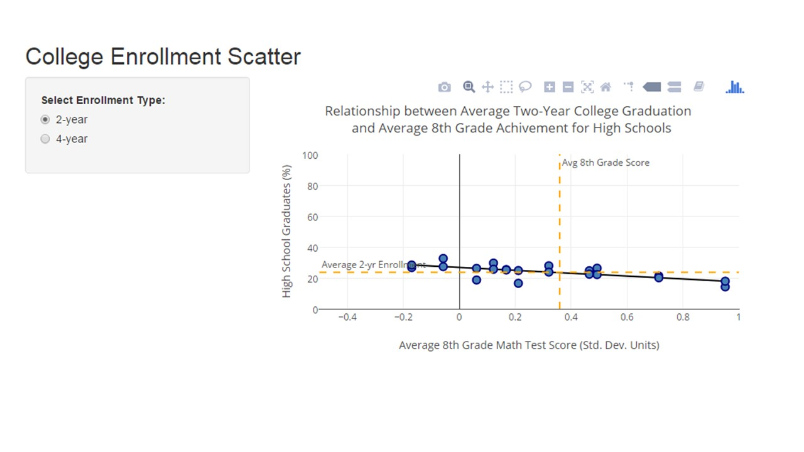
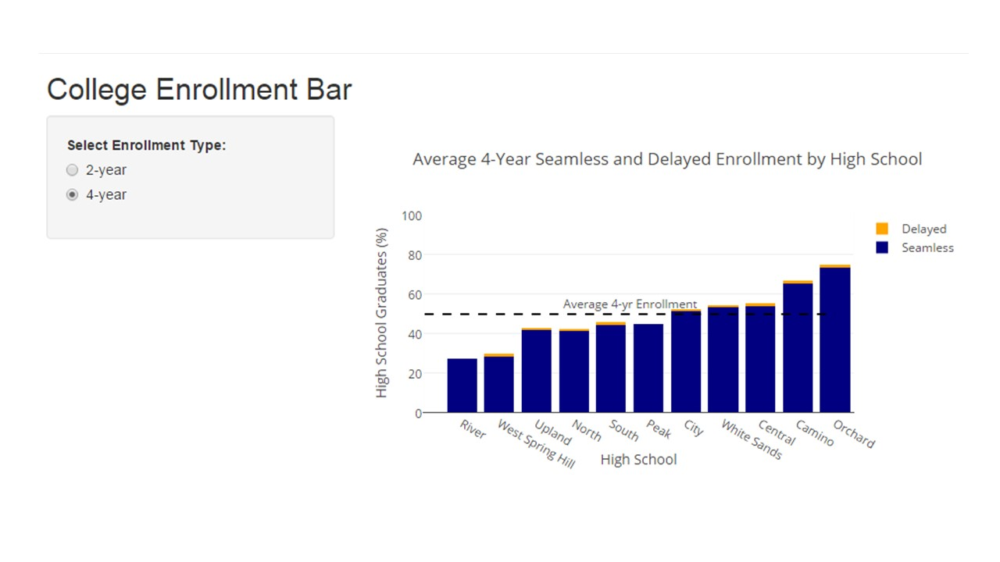
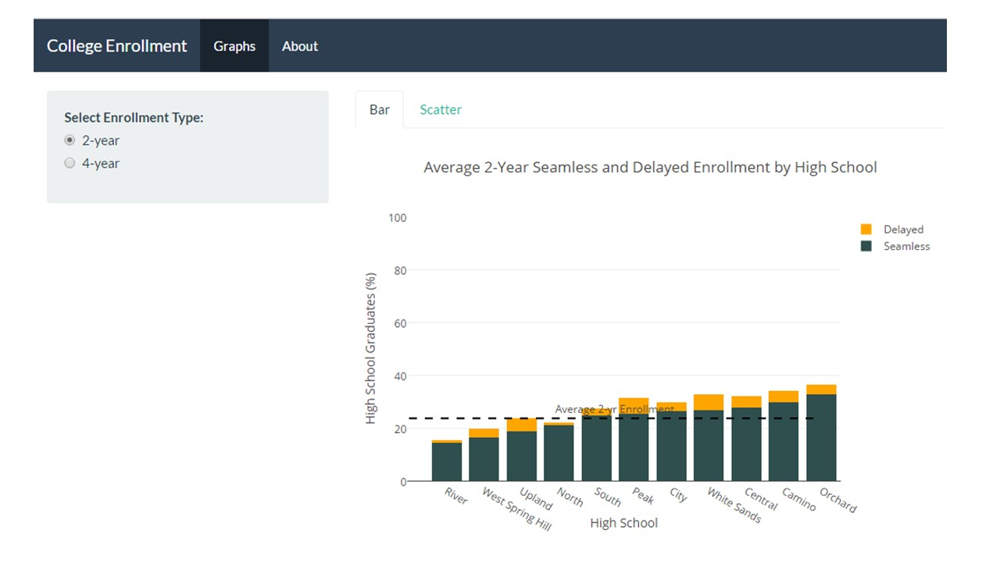

```{r setup, include=FALSE}
packages <- c("learnr","ggplot2","plotly", "shiny", "shinythemes")
lapply(packages, library, character.only = TRUE)
knitr::opts_chunk$set(echo = FALSE)
```

```{r, out.width = "400px", echo=FALSE}

```

## Introduction

This tutorial is an introduction to making interactive graphics, and even entire websites, using R. The R packages that make this possible are "Plotly" and "Shiny."

Plotly is the R package used to create the graphs and charts in your visualization project. Plotly has an elegant default graphical style that includes all major graph types and hover-over tooltips. Take a look at the [plotly reference](https://plot.ly/r/) and have this [plotly cheat sheet](https://images.plot.ly/plotly-documentation/images/r_cheat_sheet.pdf) open as you go through the exercises in this tutorial.

Plotly alone can't give you a fully interactive user experience. The Shiny package takes interactivity to the next level. It allows us to include additional complex user controls such as sidebars and buttons. Shiny also makes it easy to create a full website for your data dashboard if you desire. You can see examples of Shiny projects in the [Shiny showcase](https://www.rstudio.com/products/shiny/shiny-user-showcase/), though these examples only scratch the surface of what [Shiny can do](http://shiny.rstudio.com/tutorial/). [This free online book](https://cpsievert.github.io/plotly_book/index.html) is also a great reference for Plotly.

```{r shinyquestion, echo=FALSE}
  quiz(
    question("Check your understanding. What are the functions of the Shiny and Plotly packages?",
      answer("Shiny creates chart graphics. Plotly adds additional user controls and website features."),
      answer("Plotly aggregates data for creating graphics. Shiny creates the interactive visualizations."),
      answer("Plotly creates chart graphics. Shiny adds additional user controls and website features.", correct = TRUE),
      answer("I don't know. Use Tableau instead.")
    )
  )
```

### Objectives

At the end of this tutorial you will be able to: 

1. Create interactive graphs using plotly

2. Add user controls to your plotly graph using shiny

3. Use shiny to make a full website in R

### Instructor's Note
This tutorial contains boxes where you can try out code for yourself. I highly encourage you to give the code a try. To run your code, hit the green "Run Code" button. If your code does not contain errors, output will appear. If the code did not run, you will see an error.

You can click the "Solution" button to see the intended answer at any time. To run the tutorial code:

- Click the solution button 

- Click "Copy to Clipboard" 

- Paste the copied code into the exercise box (`Ctrl V` keyboard shortcut or right click and click "Paste") 

- Click "Run Code"

### Our Data
This tutorial uses data from the [College-Going toolkit](www.sdp.cepr.harvard.edu/toolkit), which is unique by `student_id + year`. For simplicity, the tutorial automatically translates the toolkit data into stored school- or agency-level datasets in R. Use the space below to take a look at our data. Use the function `head(datasetname, n=5)` on `schoolData` and `agencyData` to view the first 5 lines of our datasets.

```{r loadData, include=TRUE}

schoolData <- structure(list(last_hs_name = c("River ", "West Spring Hill ", 
"Upland ", "North ", "South ", "Peak ", "City ", "White Sands ", 
"Central ", "Camino ", "Orchard "), hs_diploma = c(258L, 435L, 
263L, 205L, 435L, 257L, 194L, 392L, 337L, 453L, 529L), pct_4yr = c(27.1317829457364, 
28.0459770114943, 41.4448669201521, 41.4634146341463, 44.1379310344828, 
44.3579766536965, 51.0309278350515, 52.8061224489796, 53.4124629080119, 
65.121412803532, 73.1568998109641), pct_2yr = c(32.5581395348837, 
26.6666666666667, 18.6311787072243, 25.3658536585366, 27.816091954023, 
29.5719844357977, 16.4948453608247, 26.2755102040816, 24.6290801186944, 
21.1920529801325, 14.1776937618147), pct_4yr_delayed = c(0, 1.60919540229885, 
1.14068441064639, 0.48780487804878, 1.14942528735632, 0, 0.515463917525773, 
1.02040816326531, 1.48367952522255, 1.32450331125828, 1.13421550094518
), pct_2yr_delayed = c(3.87596899224806, 5.97701149425287, 4.94296577946768, 
5.85365853658537, 4.13793103448276, 4.28015564202335, 3.09278350515464, 
3.31632653061224, 2.67062314540059, 0.662251655629139, 1.32325141776938
), avg_test_math_8_std = c(-0.0572368162790698, -0.17006474045977, 
0.0620150684410646, 0.168237465365854, 0.320300586206897, 0.122428973929961, 
0.21138548814433, 0.492871761734694, 0.46508424925816, 0.713709099337748, 
0.951112215879017), order_2yr = c(11L, 8L, 3L, 6L, 9L, 10L, 2L, 
7L, 5L, 4L, 1L), order_4yr = 1:11), .Names = c("last_hs_name", 
"hs_diploma", "pct_4yr", "pct_2yr", "pct_4yr_delayed", "pct_2yr_delayed", 
"avg_test_math_8_std", "order_2yr", "order_4yr"), row.names = c(NA, 
-11L), class = c("tbl_df", "tbl", "data.frame"))

agencyData <- structure(list(last_hs_name = "Agency Average", hs_diploma = 3758L, 
    pct_4yr = 49.4944119212347, pct_2yr = 23.6029803086748, pct_4yr_delayed = 1.0111761575306, 
    pct_2yr_delayed = 3.40606705694518, avg_test_math_8_std = 0.359298796035125), .Names = c("last_hs_name", 
"hs_diploma", "pct_4yr", "pct_2yr", "pct_4yr_delayed", "pct_2yr_delayed", 
"avg_test_math_8_std"), row.names = c(NA, -1L), class = c("tbl_df", 
"tbl", "data.frame"))

```

```{r viewdata, exercise=TRUE, exercise.eval=FALSE, exercise.setup="loadData", warning=FALSE}

```
```{r viewdata-solution}
head(schoolData, n=5)
head(agencyData, n=5)

# Remember you access columns by putting the dataset name and the dollar sign, 
# e.g. schoolData$last_hs_name

```

## Plotly Anatomy

Plotly is the R package that we will use to render our graphs. The syntax is fairly simple. Here is a basic scatter plot. You can see the point information when you hover over the markers.

```{r basicscatter, exercise=TRUE, exercise.eval=TRUE, exercise.setup="loadData", echo=TRUE, include=TRUE, warning=FALSE}
plot_1 <- plot_ly(data = schoolData, x = ~avg_test_math_8_std, y = ~pct_4yr, type="scatter", mode = "markers")
plot_1
```
We've defined the arguments `data`, `x`, `y`, `type`, and `mode`. Note: You must repeat the name of the plot `plot_1` in order to make it show up.

### Changing markers and tooltips

Now we can redo the same basic plot, but change the marker styling and add more tooltip information. We've added definitions for `marker`, `hoverinfo`, and `text`.

```{r prettyscatter, exercise=TRUE, exercise.eval=TRUE, exercise.setup="loadData", echo=TRUE, include=TRUE, message=FALSE, warning=FALSE}
plot_2 <- plot_ly(data = schoolData, x = ~avg_test_math_8_std, y = ~pct_4yr, mode = "markers", type="scatter",
                    marker = list(size=10,
                                  color = "steelblue",
                                  line = list(
                                    color = "navy",
                                    width = 2
                                  )),
                  hoverinfo = "text",             
                  text = ~paste(
                    "School: ", schoolData$last_hs_name, "<br>",
                    "HS Graduates (N): ", schoolData$hs_diploma, "<br>",
                    "Average 8th Grade Math Score: ", format(schoolData$avg_test_math_8_std, digits=2), "%", "<br>",
                    "Seamless 4-yr Enrollment: ", format(schoolData$pct_4yr, digits=2), "%",
                    sep=""
                  )
                )
plot_2
```

### Adding Traces (Best Fit Line)
What if we want to add a best fit line to our scatter plot? This is the equivalent of adding another `plot_ly` graph to the same plot. The syntax is the same, but instead of `plot_ly()` we use `add_trace()` after our previous plot.

```{r bestfit, exercise=TRUE, exercise.eval=TRUE, exercise.setup="loadData", echo=TRUE, include=TRUE, message=FALSE, warning=FALSE, exercise.lines=25}

# Necessary to repeat code for plot_2 because of how the html document works (see below)
plot_2 <- plot_ly(data = schoolData, x = ~avg_test_math_8_std, y = ~pct_4yr, mode = "markers", type="scatter",
                    marker = list(size=10,
                                  color = "steelblue",
                                  line = list(
                                    color = "navy",
                                    width = 2
                                  )),
                  hoverinfo = "text",             
                  text = ~paste(
                    "School: ", schoolData$last_hs_name, "<br>",
                    "HS Graduates (N): ", schoolData$hs_diploma, "<br>",
                    "Average 8th Grade Math Score: ", format(schoolData$avg_test_math_8_std, digits=2), "%", "<br>",
                    "Seamless 4-yr Enrollment: ", format(schoolData$pct_4yr, digits=2), "%",
                    sep=""
                  )
                )

# Add best fit line
fit <- lm(pct_4yr ~ avg_test_math_8_std, data = schoolData)
plot_3 <- plot_2 %>%
  add_trace(x = schoolData$avg_test_math_8_std, y = fitted(fit), mode = "lines+markers", line = list(color = "black"))
plot_3
```

Note: In a regular R file we do not have to repeat the code for `plot_2` before the `add_trace`. This is a limitation of the web-browser-based environment we are working in. Keep in mind as you work through the exercises that you will have to copy code from earlier exercises if you want to call plot objects from those exercises.

### Layout: Titles and More

Other features we may want to add are simple lines for the agency average and add titles. These all go in `layout()`. The options we will use in `layout()` are: 

- `title` 

- `xaxis` (`title`, `range`, `zeroline`, `showline`) 

- `yaxis` (`title`, `range`)

- `margin`

- `showlegend`

- `shapes`

- `annotations`

But there are many more things you can add!

```{r loadData2, include=TRUE}

# Note: Repeating data load due to error in learnr package
schoolData <- structure(list(last_hs_name = c("River ", "West Spring Hill ", 
"Upland ", "North ", "South ", "Peak ", "City ", "White Sands ", 
"Central ", "Camino ", "Orchard "), hs_diploma = c(258L, 435L, 
263L, 205L, 435L, 257L, 194L, 392L, 337L, 453L, 529L), pct_4yr = c(27.1317829457364, 
28.0459770114943, 41.4448669201521, 41.4634146341463, 44.1379310344828, 
44.3579766536965, 51.0309278350515, 52.8061224489796, 53.4124629080119, 
65.121412803532, 73.1568998109641), pct_2yr = c(32.5581395348837, 
26.6666666666667, 18.6311787072243, 25.3658536585366, 27.816091954023, 
29.5719844357977, 16.4948453608247, 26.2755102040816, 24.6290801186944, 
21.1920529801325, 14.1776937618147), pct_4yr_delayed = c(0, 1.60919540229885, 
1.14068441064639, 0.48780487804878, 1.14942528735632, 0, 0.515463917525773, 
1.02040816326531, 1.48367952522255, 1.32450331125828, 1.13421550094518
), pct_2yr_delayed = c(3.87596899224806, 5.97701149425287, 4.94296577946768, 
5.85365853658537, 4.13793103448276, 4.28015564202335, 3.09278350515464, 
3.31632653061224, 2.67062314540059, 0.662251655629139, 1.32325141776938
), avg_test_math_8_std = c(-0.0572368162790698, -0.17006474045977, 
0.0620150684410646, 0.168237465365854, 0.320300586206897, 0.122428973929961, 
0.21138548814433, 0.492871761734694, 0.46508424925816, 0.713709099337748, 
0.951112215879017), order_2yr = c(11L, 8L, 3L, 6L, 9L, 10L, 2L, 
7L, 5L, 4L, 1L), order_4yr = 1:11), .Names = c("last_hs_name", 
"hs_diploma", "pct_4yr", "pct_2yr", "pct_4yr_delayed", "pct_2yr_delayed", 
"avg_test_math_8_std", "order_2yr", "order_4yr"), row.names = c(NA, 
-11L), class = c("tbl_df", "tbl", "data.frame"))

agencyData <- structure(list(last_hs_name = "Agency Average", hs_diploma = 3758L, 
    pct_4yr = 49.4944119212347, pct_2yr = 23.6029803086748, pct_4yr_delayed = 1.0111761575306, 
    pct_2yr_delayed = 3.40606705694518, avg_test_math_8_std = 0.359298796035125), .Names = c("last_hs_name", 
"hs_diploma", "pct_4yr", "pct_2yr", "pct_4yr_delayed", "pct_2yr_delayed", 
"avg_test_math_8_std"), row.names = c(NA, -1L), class = c("tbl_df", 
"tbl", "data.frame"))

```

```{r layout-scatter, exercise=TRUE, exercise.eval=TRUE, exercise.setup="loadData2", echo=TRUE, include=TRUE, message=FALSE, warning=FALSE, exercise.lines=30}
# Necessary to repeat code for plot_2 because of how the html document works (see below)
plot_2 <- plot_ly(data = schoolData, x = ~avg_test_math_8_std, y = ~pct_4yr, mode = "markers", type="scatter",
                    marker = list(size=10,
                                  color = "steelblue",
                                  line = list(
                                    color = "navy",
                                    width = 2
                                  )),
                  hoverinfo = "text",             
                  text = ~paste(
                    "School: ", schoolData$last_hs_name, "<br>",
                    "HS Graduates (N): ", schoolData$hs_diploma, "<br>",
                    "Average 8th Grade Math Score: ", format(schoolData$avg_test_math_8_std, digits=2), "%", "<br>",
                    "Seamless 4-yr Enrollment: ", format(schoolData$pct_4yr, digits=2), "%",
                    sep=""
                  )
                )

# Add best fit line
fit <- lm(pct_4yr ~ avg_test_math_8_std, data = schoolData)
plot_3 <- plot_2 %>%
  add_trace(x = schoolData$avg_test_math_8_std, y = fitted(fit), mode = "lines", line = list(color = "black"))

# Create agency average lines using shapes - these lines will be added in next step
# Average 8th grade score
avg_8th_line <- list(
  type = 'line',
  line = list(color = "orange", dash = 'dash'),
  x0 = agencyData$avg_test_math_8_std,
  x1 = agencyData$avg_test_math_8_std,
  y0 = 0,
  y1 = 100
)
# Average enrollment
avg_4yr_line <- list(
  type = 'line',
  line = list(color = "orange", dash = 'dash'),
  x0 = -.5,
  x1 = 1,
  y0 = agencyData$pct_4yr,
  y1 = agencyData$pct_4yr
)
# Average 8th grade line label
avg_8th_label <- list(
  text="Avg 8th Grade Score",
  x=agencyData$avg_test_math_8_std,
  y=100,
  showarrow = FALSE,
  xanchor = 'left',
  yanchor = 'top'
)
# Average enrollment line label
avg_4yr_label <- list(
  text="Average 4-year Enrollment ",
  x=-.5,
  y=agencyData$pct_4yr,
  showarrow = FALSE,
  xanchor = 'left',
  yanchor = 'bottom'
)

# Add layout - start with plot_3
plot_3_with_opts <- layout(plot_3, 
             title = "Relationship between Average Four-Year College Graduation <br> and Average 8th Grade Achivement for High Schools",
             xaxis = list(
               title = "Average 8th Grade Math Test Score (Std. Dev. Units)",
               range = c(-.5, 1),
               zeroline = TRUE,
               showline = TRUE
             ),
             yaxis = list(
               title = "High School Graduates (%)",
               range = c(0,100)
             ),
             margin = list(b = 100, t = 100),
             showlegend = FALSE,
             shapes = list(avg_8th_line, avg_4yr_line),
             annotations = list(avg_8th_label, avg_4yr_label)
)
plot_3_with_opts
```

### Review

Recap: 

1. Start your graph using the basic `plot_ly()` arguments such as `x`, `y`, and `data`. 

2. Modify bars or markers, and hover text also inside `plot_ly()` 

3. To add more data in the `plot_ly()` format to the same graph, use `add_trace()` and put in the `plot_ly()` arguments 

4. Modify titles, axes, legends, and add basic shape lines and text using `layout()`

Now it's your turn.

## Plotly Exercises

```{r loadData3, include=TRUE}

# Note: Repeating data load due to error in learnr package
schoolData <- structure(list(last_hs_name = c("River ", "West Spring Hill ", 
"Upland ", "North ", "South ", "Peak ", "City ", "White Sands ", 
"Central ", "Camino ", "Orchard "), hs_diploma = c(258L, 435L, 
263L, 205L, 435L, 257L, 194L, 392L, 337L, 453L, 529L), pct_4yr = c(27.1317829457364, 
28.0459770114943, 41.4448669201521, 41.4634146341463, 44.1379310344828, 
44.3579766536965, 51.0309278350515, 52.8061224489796, 53.4124629080119, 
65.121412803532, 73.1568998109641), pct_2yr = c(32.5581395348837, 
26.6666666666667, 18.6311787072243, 25.3658536585366, 27.816091954023, 
29.5719844357977, 16.4948453608247, 26.2755102040816, 24.6290801186944, 
21.1920529801325, 14.1776937618147), pct_4yr_delayed = c(0, 1.60919540229885, 
1.14068441064639, 0.48780487804878, 1.14942528735632, 0, 0.515463917525773, 
1.02040816326531, 1.48367952522255, 1.32450331125828, 1.13421550094518
), pct_2yr_delayed = c(3.87596899224806, 5.97701149425287, 4.94296577946768, 
5.85365853658537, 4.13793103448276, 4.28015564202335, 3.09278350515464, 
3.31632653061224, 2.67062314540059, 0.662251655629139, 1.32325141776938
), avg_test_math_8_std = c(-0.0572368162790698, -0.17006474045977, 
0.0620150684410646, 0.168237465365854, 0.320300586206897, 0.122428973929961, 
0.21138548814433, 0.492871761734694, 0.46508424925816, 0.713709099337748, 
0.951112215879017), order_2yr = c(11L, 8L, 3L, 6L, 9L, 10L, 2L, 
7L, 5L, 4L, 1L), order_4yr = 1:11), .Names = c("last_hs_name", 
"hs_diploma", "pct_4yr", "pct_2yr", "pct_4yr_delayed", "pct_2yr_delayed", 
"avg_test_math_8_std", "order_2yr", "order_4yr"), row.names = c(NA, 
-11L), class = c("tbl_df", "tbl", "data.frame"))

agencyData <- structure(list(last_hs_name = "Agency Average", hs_diploma = 3758L, 
    pct_4yr = 49.4944119212347, pct_2yr = 23.6029803086748, pct_4yr_delayed = 1.0111761575306, 
    pct_2yr_delayed = 3.40606705694518, avg_test_math_8_std = 0.359298796035125), .Names = c("last_hs_name", 
"hs_diploma", "pct_4yr", "pct_2yr", "pct_4yr_delayed", "pct_2yr_delayed", 
"avg_test_math_8_std"), row.names = c(NA, -1L), class = c("tbl_df", 
"tbl", "data.frame"))

```

### Basic Bar Graph (and Custom Tooltips)

Instead of a scatter plot we will be building a bar graph as an exercise. Each bar will be a school and our outcome will be 4-year enrollment. Because we want the bars sorted from lowest to highest by enrollment, we use `order_4yr` as our `x` variable. We will add the school names to the x-axis in a later step. In the exercise below, there is an outline of the graph code. Input the missing information. Remember, you can return to the first page if you need to see variable names and refer to the previous scatter plot example. Feel free to change the colors or other features. A full list of colors is available [here](https://www.w3.org/TR/css3-color/#svg-color). Note: You could also use RGB or hex colors.

```{r basic-bar, exercise=TRUE, exercise.eval=FALSE, exercise.setup="loadData3"}

bar_1 <- plot_ly(data = schoolData, x = ?, y = ?, type="?", name="Seamless",
                  text = ~paste(
                    "School: ", schoolData$last_hs_name, "<br>",
                    "HS Graduates (N): ", schoolData$hs_diploma, "<br>",
                    "Seamless Enrollment: ", format(schoolData$pct_4yr, digits = 2), "%", "<br>",
                    "Delayed Enrollment: ", format(schoolData$pct_4yr_delayed, digits = 2), "%",
                    sep=""
                  ),
                  hoverinfo = "?",
                  color = I("navy")
                  )
bar_1
```
```{r basic-bar-solution}
bar_1 <- plot_ly(data = schoolData, x = ~order_4yr, y = ~pct_4yr, type="bar", name="Seamless",
                  text = ~paste(
                    "School: ", schoolData$last_hs_name, "<br>",
                    "HS Graduates (N): ", schoolData$hs_diploma, "<br>",
                    "Seamless Enrollment: ", format(schoolData$pct_4yr, digits = 2), "%", "<br>",
                    "Delayed Enrollment: ", format(schoolData$pct_4yr_delayed, digits = 2), "%",
                    sep=""
                  ),
                  hoverinfo = "text",
                  color = I("navy")
                  )
bar_1
```

Clicking the solution button will review the solution. Did you get it?

### Add Additional Bars Side-By-Side

Let's also add the delayed enrollment percentages for each school to our graph. This is equivalent to adding another `plot_ly` graph, so we use `add_trace`. We have to add the trace to `bar_1` so `bar_1` is already filled in from the previous exercise. If you want to use your own graph, copy and paste your code from the previous exercise. Complete the outline for `add_trace()`.

```{r bar-add-trace, exercise=TRUE, exercise.eval=FALSE, exercise.setup="loadData3"}
# bar_1 complete or add your code here
bar_1 <- plot_ly(data = schoolData, x = ~order_4yr, y = ~pct_4yr, type="bar", name="Seamless",
                  text = ~paste(
                    "School: ", schoolData$last_hs_name, "<br>",
                    "HS Graduates (N): ", schoolData$hs_diploma, "<br>",
                    "Seamless Enrollment: ", format(schoolData$pct_4yr, digits = 2), "%", "<br>",
                    "Delayed Enrollment: ", format(schoolData$pct_4yr_delayed, digits = 2), "%",
                    sep=""
                  ),
                  hoverinfo = "text",
                  color = I("navy")
                  )
# End bar_1 or your code

# ***Fill in add_trace()***
bar_2 <- add_trace(?, x = ?, y = ?, 2, name = "Delayed", 
                  color = I("orange"),
                  hoverinfo = "none"
                  )
bar_2
```
```{r bar-add-trace-solution}
bar_1 <- plot_ly(data = schoolData, x = ~order_4yr, y = ~pct_4yr, type="bar", name="Seamless",
                  text = ~paste(
                    "School: ", schoolData$last_hs_name, "<br>",
                    "HS Graduates (N): ", schoolData$hs_diploma, "<br>",
                    "Seamless Enrollment: ", format(schoolData$pct_4yr, digits = 2), "%", "<br>",
                    "Delayed Enrollment: ", format(schoolData$pct_4yr_delayed, digits = 2), "%",
                    sep=""
                  ),
                  hoverinfo = "text",
                  color = I("navy")
                  )
bar_2 <- add_trace(bar_1, x = ~order_4yr, y = ~pct_4yr_delayed, 2, name = "Delayed", 
                  color = I("orange"),
                  hoverinfo = "none"
                  )
bar_2
```

### Stacking Bars

To stack the bars, we use `layout()` and add `barmode = "stack"`. Add this below.

```{r bar-stack, exercise=TRUE, exercise.eval=FALSE, exercise.setup="loadData3", exercise.lines=20}
# bar_1 complete or add your code here
bar_1 <- plot_ly(data = schoolData, x = ~order_4yr, y = ~pct_4yr, type="bar", name="Seamless",
                  text = ~paste(
                    "School: ", schoolData$last_hs_name, "<br>",
                    "HS Graduates (N): ", schoolData$hs_diploma, "<br>",
                    "Seamless Enrollment: ", format(schoolData$pct_4yr, digits = 2), "%", "<br>",
                    "Delayed Enrollment: ", format(schoolData$pct_4yr_delayed, digits = 2), "%",
                    sep=""
                  ),
                  hoverinfo = "text",
                  color = I("navy")
                  )
# End bar_1 or your code

# bar_2 complete or add your code here
bar_2 <- add_trace(bar_1, x = ~order_4yr, y = ~pct_4yr_delayed, 2, name = "Delayed", 
                  color = I("orange"),
                  hoverinfo = "none"
                  )
# End bar_2 or your code

# ***Fill in bar_3***
bar_3 <- layout(?, barmode = "?")
bar_3
```

```{r bar-stack-solution}
bar_1 <- plot_ly(data = schoolData, x = ~order_4yr, y = ~pct_4yr, type="bar", name="Seamless",
                  text = ~paste(
                    "School: ", schoolData$last_hs_name, "<br>",
                    "HS Graduates (N): ", schoolData$hs_diploma, "<br>",
                    "Seamless Enrollment: ", format(schoolData$pct_4yr, digits = 2), "%", "<br>",
                    "Delayed Enrollment: ", format(schoolData$pct_4yr_delayed, digits = 2), "%",
                    sep=""
                  ),
                  hoverinfo = "text",
                  color = I("navy")
                  )
bar_2 <- add_trace(bar_1, x = ~order_4yr, y = ~pct_4yr_delayed, 2, name = "Delayed", 
                  color = I("orange"),
                  hoverinfo = "none"
                  )
bar_3 <- layout(bar_2, barmode = "stack")
bar_3
```

### Add Lines and Labels

Just like in the previous scatter example, we will now add lines and text, and change the layout to add titles.

```{r bar-layout, exercise=TRUE, exercise.eval=FALSE, exercise.setup="loadData3", exercise.lines=30}
# bar_1 complete or add your code here
bar_1 <- plot_ly(data = schoolData, x = ~order_4yr, y = ~pct_4yr, type="bar", name="Seamless",
                  text = ~paste(
                    "School: ", schoolData$last_hs_name, "<br>",
                    "HS Graduates (N): ", schoolData$hs_diploma, "<br>",
                    "Seamless Enrollment: ", format(schoolData$pct_4yr, digits = 2), "%", "<br>",
                    "Delayed Enrollment: ", format(schoolData$pct_4yr_delayed, digits = 2), "%",
                    sep=""
                  ),
                  hoverinfo = "text",
                  color = I("navy")
                  )
# End bar_1 or your code

# bar_2 complete or add your code here
bar_2 <- add_trace(bar_1, x = ~order_4yr, y = ~pct_4yr_delayed, 2, name = "Delayed", 
                  color = I("orange"),
                  hoverinfo = "none"
                  )
# End bar_2 or your code

# bar_3 complete or add your code here
bar_3 <- layout(bar_2, barmode = "stack")
# End bar_3 or your code

# Added lines and text - nothing to do here, filled in for you
# Average enrollment line 
avg_line <- list(
  type = 'line',
  line = list(color = "black", dash = 'dash'),
  x0 = 0,
  x1 = 11,
  y0 = agencyData$pct_4yr,
  y1 = agencyData$pct_4yr
)
# Average enrollment line label - Nothing to fill in here, done for you
# X position chosen by looking at number of schools and divide that in half for the x position 
avg_line_label <- list(
  text="Average 4-year Enrollment",
  x=5.5,
  y=agencyData$pct_4yr,
  showarrow = FALSE,
  xanchor = 'center',
  yanchor = 'bottom'
)

# ***Fill in the missing information in layout outline***
bar_3_with_opts <- layout(?, 
                           title = "Average 4-Year Seamless and Delayed Enrollment by High School",
                           xaxis = ?(
                             title = "High School",
                             tickvals = 1:length(schoolData$last_hs_name),
                             ticktext = schoolData$last_hs_name,
                             zeroline = ?,
                             showline = ?
                           ),
                           yaxis = ?(
                             title = "High School Graduates (%)",
                             range = c(0,?)
                           ),
                           margin = list(b = 100, t = 100),
                           shapes = list(?),
                           annotations = list(?)
)
bar_3_with_opts
```
```{r bar-layout-solution}
bar_1 <- plot_ly(data = schoolData, x = ~order_4yr, y = ~pct_4yr, type="bar", name="Seamless",
                  text = ~paste(
                    "School: ", schoolData$last_hs_name, "<br>",
                    "HS Graduates (N): ", schoolData$hs_diploma, "<br>",
                    "Seamless Enrollment: ", format(schoolData$pct_4yr, digits = 2), "%", "<br>",
                    "Delayed Enrollment: ", format(schoolData$pct_4yr_delayed, digits = 2), "%",
                    sep=""
                  ),
                  hoverinfo = "text",
                  color = I("navy")
                  )
bar_2 <- add_trace(bar_1, x = ~order_4yr, y = ~pct_4yr_delayed, 2, name = "Delayed", 
                  color = I("orange"),
                  hoverinfo = "none"
                  )
bar_3 <- layout(bar_2, barmode = "stack")

# Average enrollment line
avg_line <- list(
  type = 'line',
  line = list(color = "black", dash = 'dash'),
  x0 = 0,
  x1 = 11,
  y0 = agencyData$pct_4yr,
  y1 = agencyData$pct_4yr
)
# Average enrollment line label
# X position chosen by looking at number of schools and dividing that in half, could be done dynamically
avg_line_label <- list(
  text="Average 4-year Enrollment",
  x=5.5,
  y=agencyData$pct_4yr,
  showarrow = FALSE,
  xanchor = 'center',
  yanchor = 'bottom'
)

bar_3_with_opts <- layout(bar_3, 
                           title = "Average 4-Year Seamless and Delayed Enrollment by High School",
                           xaxis = list(
                             title = "High School",
                             tickvals = 1:length(schoolData$last_hs_name),
                             ticktext = schoolData$last_hs_name,
                             zeroline = TRUE,
                             showline = TRUE
                           ),
                           yaxis = list(
                             title = "High School Graduates (%)",
                             range = c(0,100)
                           ),
                           margin = list(b = 100, t = 100),
                           shapes = list(avg_line),
                           annotations = list(avg_line_label)
)
bar_3_with_opts
```

```{r xaxis-question, echo=FALSE}
  quiz(
    question("Check your understanding by filling in the blanks. _____ set the categorical range for the x-axis ticks and _____ labeled the ticks with the high school names.",
      answer("ticktext, tickvals"),
      answer("range, ticktext"),
      answer("range, title"),
      answer("tickvals, ticktext", correct = TRUE)
    )
  )
```

## Quick Aside on Functions

```{r loadData4, include=TRUE}

# Note: Repeating data load due to error in learnr package
schoolData <- structure(list(last_hs_name = c("River ", "West Spring Hill ", 
"Upland ", "North ", "South ", "Peak ", "City ", "White Sands ", 
"Central ", "Camino ", "Orchard "), hs_diploma = c(258L, 435L, 
263L, 205L, 435L, 257L, 194L, 392L, 337L, 453L, 529L), pct_4yr = c(27.1317829457364, 
28.0459770114943, 41.4448669201521, 41.4634146341463, 44.1379310344828, 
44.3579766536965, 51.0309278350515, 52.8061224489796, 53.4124629080119, 
65.121412803532, 73.1568998109641), pct_2yr = c(32.5581395348837, 
26.6666666666667, 18.6311787072243, 25.3658536585366, 27.816091954023, 
29.5719844357977, 16.4948453608247, 26.2755102040816, 24.6290801186944, 
21.1920529801325, 14.1776937618147), pct_4yr_delayed = c(0, 1.60919540229885, 
1.14068441064639, 0.48780487804878, 1.14942528735632, 0, 0.515463917525773, 
1.02040816326531, 1.48367952522255, 1.32450331125828, 1.13421550094518
), pct_2yr_delayed = c(3.87596899224806, 5.97701149425287, 4.94296577946768, 
5.85365853658537, 4.13793103448276, 4.28015564202335, 3.09278350515464, 
3.31632653061224, 2.67062314540059, 0.662251655629139, 1.32325141776938
), avg_test_math_8_std = c(-0.0572368162790698, -0.17006474045977, 
0.0620150684410646, 0.168237465365854, 0.320300586206897, 0.122428973929961, 
0.21138548814433, 0.492871761734694, 0.46508424925816, 0.713709099337748, 
0.951112215879017), order_2yr = c(11L, 8L, 3L, 6L, 9L, 10L, 2L, 
7L, 5L, 4L, 1L), order_4yr = 1:11), .Names = c("last_hs_name", 
"hs_diploma", "pct_4yr", "pct_2yr", "pct_4yr_delayed", "pct_2yr_delayed", 
"avg_test_math_8_std", "order_2yr", "order_4yr"), row.names = c(NA, 
-11L), class = c("tbl_df", "tbl", "data.frame"))

agencyData <- structure(list(last_hs_name = "Agency Average", hs_diploma = 3758L, 
    pct_4yr = 49.4944119212347, pct_2yr = 23.6029803086748, pct_4yr_delayed = 1.0111761575306, 
    pct_2yr_delayed = 3.40606705694518, avg_test_math_8_std = 0.359298796035125), .Names = c("last_hs_name", 
"hs_diploma", "pct_4yr", "pct_2yr", "pct_4yr_delayed", "pct_2yr_delayed", 
"avg_test_math_8_std"), row.names = c(NA, -1L), class = c("tbl_df", 
"tbl", "data.frame"))

```

To make our graph interactive, we have to make it so that the graph code changes the arguments and data elements within it based on user input. The easiest way to do this is to change our graph code into a function. OUr function will take basic input arguments and use those inputs to change the output. A very basic example of a function is below. Put whatever text you want where it says "Your text here" and watch it get printed out. 

```{r basic-function, exercise=TRUE, exercise.eval=FALSE, echo=TRUE, include=TRUE, message=FALSE, warning=FALSE}

printme <- function(x){
  print(x)
}

printme(x="Your text here")

```

We want to do the same thing for our graphing code so that we can have the graph be for 2-year or 4-year enrollment. Our input is "2" or "4" and graph output changes based on that input. Below we can take all parameters in the college enrollment scatter that should change with the selection of 2-year or 4-year enrollment and change them using and if statement. Put 2 or 4 into the function at the bottom and watch the graph change.

```{r scatter-function, exercise=TRUE, exercise.eval=TRUE, echo=TRUE, include=TRUE, message=FALSE, warning=FALSE, exercise.setup="loadData4", exercise.lines=30}

scatter_function <- function(college_type){
  
  if (college_type == 2){
    school_y <- schoolData$pct_2yr
    agency_y <- agencyData$pct_2yr
    tooltip_title <- "Seamless 2-yr Enrollment: "
    avg_label <- "Average 2-yr Enrollment"
    title <- "Relationship between Average Two-Year College Graduation <br> and Average 8th Grade Achivement for High Schools"
  } 
  else if (college_type==4){
    school_y <- schoolData$pct_4yr
    agency_y <- agencyData$pct_4yr
    tooltip_title <- "Seamless 4-yr Enrollment: "
    avg_label <- "Average 4-yr Enrollment"
    title <- "Relationship between Average Four-Year College Graduation <br> and Average 8th Grade Achivement for High Schools"
  }
  else{
    stop("college_type must be 2 or 4")
  }
  
  # Same plot but make the markers bigger, change the marker colors
  # Named colors list https://www.w3.org/TR/css3-color/#svg-color
  plot_2 <- plot_ly(data = schoolData, x = ~avg_test_math_8_std, y = school_y, mode = "markers", type="scatter",
                    marker = list(size=10,
                                  color = "steelblue",
                                  line = list(
                                    color = "navy",
                                    width = 2
                                  )),
                    hoverinfo = "text",             
                    text = ~paste(
                      "School: ", schoolData$last_hs_name, "<br>",
                      "HS Graduates (N): ", schoolData$hs_diploma, "<br>",
                      "Average 8th Grade Math Score: ", format(schoolData$avg_test_math_8_std, digits=2), "%", "<br>",
                      tooltip_title, format(school_y, digits=2), "%",
                      sep=""
                    )
  )
  
  # Adding lines
  # Add fit line
  fit <- lm(school_y ~ avg_test_math_8_std, data = schoolData)
  plot_3 <- plot_2 %>%
    add_trace(x = schoolData$avg_test_math_8_std, y = fitted(fit), mode = "lines", line = list(color = "black"))
  plot_3
  
  # Create agency average lines using shapes - these lines will be added in next step
  # Average 8th grade score
  avg_8th_line <- list(
    type = 'line',
    line = list(color = "orange", dash = 'dash'),
    x0 = agencyData$avg_test_math_8_std,
    x1 = agencyData$avg_test_math_8_std,
    y0 = 0,
    y1 = 100
  )
  # Average enrollment
  avg_4yr_line <- list(
    type = 'line',
    line = list(color = "orange", dash = 'dash'),
    x0 = -.5,
    x1 = 1,
    y0 = agency_y,
    y1 = agency_y
  )
  # Average 8th grade line label
  avg_8th_label <- list(
    text="Avg 8th Grade Score",
    x=agencyData$avg_test_math_8_std,
    y=100,
    showarrow = FALSE,
    xanchor = 'left',
    yanchor = 'top'
  )
  # Average enrollment line label
  avg_4yr_label <- list(
    text=avg_label,
    x=-.5,
    y=agency_y,
    showarrow = FALSE,
    xanchor = 'left',
    yanchor = 'bottom'
  )
  
  # Add lines and Styling options to plot 3
  plot_3_with_opts <- layout(plot_3, 
                             title = title,
                             xaxis = list(
                               title = "Average 8th Grade Math Test Score (Std. Dev. Units)",
                               range = c(-.5, 1),
                               zeroline = TRUE,
                               showline = TRUE
                             ),
                             yaxis = list(
                               title = "High School Graduates (%)",
                               range = c(0,100)
                             ),
                             margin = list(b = 100, t = 100),
                             showlegend = FALSE,
                             shapes = list(avg_8th_line, avg_4yr_line),
                             annotations = list(avg_8th_label, avg_4yr_label)
  )
  
  return(plot_3_with_opts)

} # End function

scatter_function(college_type=2)

```

Time permitting, try the same exercise on our bar chart.


```{r loadData5, include=TRUE}

# Note: Repeating data load due to error in learnr package
schoolData <- structure(list(last_hs_name = c("River ", "West Spring Hill ", 
"Upland ", "North ", "South ", "Peak ", "City ", "White Sands ", 
"Central ", "Camino ", "Orchard "), hs_diploma = c(258L, 435L, 
263L, 205L, 435L, 257L, 194L, 392L, 337L, 453L, 529L), pct_4yr = c(27.1317829457364, 
28.0459770114943, 41.4448669201521, 41.4634146341463, 44.1379310344828, 
44.3579766536965, 51.0309278350515, 52.8061224489796, 53.4124629080119, 
65.121412803532, 73.1568998109641), pct_2yr = c(32.5581395348837, 
26.6666666666667, 18.6311787072243, 25.3658536585366, 27.816091954023, 
29.5719844357977, 16.4948453608247, 26.2755102040816, 24.6290801186944, 
21.1920529801325, 14.1776937618147), pct_4yr_delayed = c(0, 1.60919540229885, 
1.14068441064639, 0.48780487804878, 1.14942528735632, 0, 0.515463917525773, 
1.02040816326531, 1.48367952522255, 1.32450331125828, 1.13421550094518
), pct_2yr_delayed = c(3.87596899224806, 5.97701149425287, 4.94296577946768, 
5.85365853658537, 4.13793103448276, 4.28015564202335, 3.09278350515464, 
3.31632653061224, 2.67062314540059, 0.662251655629139, 1.32325141776938
), avg_test_math_8_std = c(-0.0572368162790698, -0.17006474045977, 
0.0620150684410646, 0.168237465365854, 0.320300586206897, 0.122428973929961, 
0.21138548814433, 0.492871761734694, 0.46508424925816, 0.713709099337748, 
0.951112215879017), order_2yr = c(11L, 8L, 3L, 6L, 9L, 10L, 2L, 
7L, 5L, 4L, 1L), order_4yr = 1:11), .Names = c("last_hs_name", 
"hs_diploma", "pct_4yr", "pct_2yr", "pct_4yr_delayed", "pct_2yr_delayed", 
"avg_test_math_8_std", "order_2yr", "order_4yr"), row.names = c(NA, 
-11L), class = c("tbl_df", "tbl", "data.frame"))

agencyData <- structure(list(last_hs_name = "Agency Average", hs_diploma = 3758L, 
    pct_4yr = 49.4944119212347, pct_2yr = 23.6029803086748, pct_4yr_delayed = 1.0111761575306, 
    pct_2yr_delayed = 3.40606705694518, avg_test_math_8_std = 0.359298796035125), .Names = c("last_hs_name", 
"hs_diploma", "pct_4yr", "pct_2yr", "pct_4yr_delayed", "pct_2yr_delayed", 
"avg_test_math_8_std"), row.names = c(NA, -1L), class = c("tbl_df", 
"tbl", "data.frame"))

```

```{r bar-function, exercise=TRUE, exercise.eval=FALSE, echo=TRUE, include=TRUE, message=FALSE, warning=FALSE, exercise.setup="loadData5", exercise.lines=30}

bar_function <- function(college_type){
  
  # 2-year is filled in for you
  if (college_type == 2){
    school_seamless <- schoolData$pct_2yr
    agency_seamless <- agencyData$pct_2yr
    school_delayed <- schoolData$pct_2yr_delayed
    order <- schoolData$order_2yr
    tooltip_title_seamless <- "Seamless 2-yr Enrollment: "
    tooltip_title_delayed <- "Delayed 2-yr Enrollment: "
    avg_label <- "Average 2-yr Enrollment"
    title <- "Average 2-Year Seamless and Delayed Enrollment by High School"
  } 
  # ***Try 4-year***
  else if (college_type==4){
    school_seamless <- ?
    agency_seamless <- ?
    school_delayed <- ?
    order <- ?
    tooltip_title_seamless <- ?
    tooltip_title_delayed <- ?
    avg_label <- ?
    title <- ?
  }
  else{
    stop("college_type must be 2 or 4")
  }
  
  # Fill in the inputs for bar_1. The rest is done for you.
  bar_1 <- plot_ly(data = schoolData, x = ?, y = ?, type="bar", name="Seamless",
                   text = ~paste(
                     "School: ", schoolData$last_hs_name, "<br>",
                     "HS Graduates (N): ", schoolData$hs_diploma, "<br>",
                     ? , format(?, digits = 2), "%", "<br>",
                     ?, format(?, digits = 2), "%",
                     sep=""
                   ),
                   hoverinfo = "text",
                   color = I("navy")
  )
  bar_1
  
  # Add delayed enrollment to graph - turn the hover off using hoverinfo = none
  bar_2 <- add_trace(bar_1, x = order, y = school_delayed, 2, name = "Delayed", 
                     color = I("orange"),
                     hoverinfo = "none"
  )
  bar_2
  
  # Stack them up! Change the barmode to stack in layout
  bar_3 <- layout(bar_2, barmode = "stack")
  bar_3
  
  # Add line and line label for average seamless rate and format the plot with style()
  # Average enrollment line
  avg_line <- list(
    type = 'line',
    line = list(color = "black", dash = 'dash'),
    x0 = 0,
    x1 = 11,
    y0 = agency_seamless,
    y1 = agency_seamless
  )
  # Average enrollment line label
  # Hint: look at the number of schools and divide that in half for the x position 
  avg_line_label <- list(
    text=avg_label,
    x=5.5,
    y=agency_seamless,
    showarrow = FALSE,
    xanchor = 'center',
    yanchor = 'bottom'
  )
  
  bar_3_with_opts <- layout(bar_3, 
                            title = title,
                            xaxis = list(
                              title = "High School",
                              tickvals = 1:length(schoolData$last_hs_name),
                              ticktext = schoolData$last_hs_name,
                              zeroline = TRUE,
                              showline = TRUE
                            ),
                            yaxis = list(
                              title = "High School Graduates (%)",
                              range = c(0,100)
                            ),
                            margin = list(b = 100, t = 100),
                            shapes = list(avg_line),
                            annotations = list(avg_line_label)
  )
  bar_3_with_opts
  
  # Make sure you return the output
  return(bar_3_with_opts)
  
} # End function

# Put in 2 or 4 here and watch the graph change when you run the code!
bar_function(2)

```

```{r bar-function-solution}

bar_function <- function(college_type){
  
  if (college_type == 2){
    school_seamless <- schoolData$pct_2yr
    agency_seamless <- agencyData$pct_2yr
    school_delayed <- schoolData$pct_2yr_delayed
    order <- schoolData$order_2yr
    tooltip_title_seamless <- "Seamless 2-yr Enrollment: "
    tooltip_title_delayed <- "Delayed 2-yr Enrollment: "
    avg_label <- "Average 2-yr Enrollment"
    title <- "Average 2-Year Seamless and Delayed Enrollment by High School"
  } 
  else if (college_type==4){
    school_seamless <- schoolData$pct_4yr
    agency_seamless <- agencyData$pct_4yr
    school_delayed <- schoolData$pct_4yr_delayed
    order <- schoolData$order_4yr
    tooltip_title_seamless <- "Seamless 4-yr Enrollment: "
    tooltip_title_delayed <- "Delayed 4-yr Enrollment: "
    avg_label <- "Average 4-yr Enrollment"
    title <- "Average 4-Year Seamless and Delayed Enrollment by High School"
  }
  else{
    stop("college_type must be 2 or 4")
  }
  
  bar_1 <- plot_ly(data = schoolData, x = order, y = school_seamless, type="bar", name="Seamless",
                   text = ~paste(
                     "School: ", schoolData$last_hs_name, "<br>",
                     "HS Graduates (N): ", schoolData$hs_diploma, "<br>",
                     tooltip_title_seamless , format(school_seamless, digits = 2), "%", "<br>",
                     tooltip_title_delayed, format(school_delayed, digits = 2), "%",
                     sep=""
                   ),
                   hoverinfo = "text",
                   color = I("navy")
  )
  bar_1
  
  # Add delayed enrollment to graph - turn the hover off using hoverinfo = none
  bar_2 <- add_trace(bar_1, x = order, y = school_delayed, 2, name = "Delayed", 
                     color = I("orange"),
                     hoverinfo = "none"
  )
  bar_2
  
  # Stack them up! Change the barmode to stack in layout
  bar_3 <- layout(bar_2, barmode = "stack")
  bar_3
  
  # Add line and line label for average seamless rate and format the plot with style()
  # Average enrollment line
  avg_line <- list(
    type = 'line',
    line = list(color = "black", dash = 'dash'),
    x0 = 0,
    x1 = 11,
    y0 = agency_seamless,
    y1 = agency_seamless
  )
  # Average enrollment line label
  # Hint: look at the number of schools and divide that in half for the x position 
  avg_line_label <- list(
    text=avg_label,
    x=5.5,
    y=agency_seamless,
    showarrow = FALSE,
    xanchor = 'center',
    yanchor = 'bottom'
  )
  
  bar_3_with_opts <- layout(bar_3, 
                            title = title,
                            xaxis = list(
                              title = "High School",
                              tickvals = 1:length(schoolData$last_hs_name),
                              ticktext = schoolData$last_hs_name,
                              zeroline = TRUE,
                              showline = TRUE
                            ),
                            yaxis = list(
                              title = "High School Graduates (%)",
                              range = c(0,100)
                            ),
                            margin = list(b = 100, t = 100),
                            shapes = list(avg_line),
                            annotations = list(avg_line_label)
  )
  bar_3_with_opts
  
  # Make sure you return the output
  return(bar_3_with_opts)
  
} # End function

# Put in 2 or 4 here and watch the graph change when you run the code!
bar_function(2)

```

## Shiny + Plotly

Shiny will allow us to add interactivity to our graphs and even build a full website using R. Here is a [reference page](http://shiny.rstudio.com/images/shiny-cheatsheet.pdf) for building a Shiny App. Shiny apps can get very complicated, but the basic template is simple:

1. Define `ui` (user interface). Typically this is `fluidpage`. This is where the content of the webpage goes. `ui <- fluidpage()`

2. Define `server <- function(input, output) {}` Inside the curly braces put what is updated based on the input from the user interface.

3. Add the line `shinyApp(ui = ui, server = server)`

Done!

User input comes from Shiny widgets. There are [many other widgets available](https://shiny.rstudio.com/gallery/widget-gallery.html). Some example widgets are below. Feel free to try out other widgets from the gallery.

```{r shinywidgets, exercise=TRUE, exercise.eval=TRUE, echo=TRUE, include=TRUE, message=FALSE, warning=FALSE}

 radioButtons("buttons", label = "Select Enrollment Type:",
                   choices = list("2-year" = 2, "4-year" = 4)
              )

  selectInput("select", label = h3("Select a School"), 
    choices = list("School A" = 1, "School B" = 2, "School C" = 3), 
    selected = 1)

```

### Ending interactivity

Unfotunately this concludes the interactive portion of the tutorial in your web browser because the `learnr` [tutorial package](https://rstudio.github.io/learnr/) does not currently support embedding Shiny Apps. You may still follow along in this tutorial. You will run the remainder of the content on your local machine in RStudio using the R scripts on our [strategicdataproject/dataviz-r ](https://github.com/strategicdataproject/dataviz-r) github page. 

To install RStudio, you must first download and install R [here](https://www.r-project.org/). Then, download and install RStudio [here](https://www.rstudio.com/products/rstudio/download2/). Once in RStudio, install the Shiny and Plotly packages by going to `Tools` -> `Install Packages`. 

### Example Scatter in Shiny

After downloading the [Github repository](https://github.com/strategicdataproject/dataviz-r), open `1_shiny_example_scatter.R`. Scroll to line 126. Here you can see the layout for our ShinyApp. Within `fluidpage()` there is the `titlePanel`, which puts the title at the top, and `sidebarLayout` which gives the page a `sidebarPanel` where our controls are and a `mainPanel` where our graph lives. Inside `server`, we render our `scatterfunction` using `renderPlotly`. 

```{r shinyscatter, echo=TRUE, include=TRUE, eval=FALSE}

# Simple example - control the scatter with a sidebar
ui <- fluidPage(
  
  titlePanel("College Enrollment Scatter"),
  
  sidebarLayout(
    sidebarPanel(
          radioButtons("buttons", label = "Select Enrollment Type:",
            choices = list("2-year" = 2, "4-year" = 4)
          )
    ),
    mainPanel(plotlyOutput("scatter"))
  )
  
)

server <- function(input, output) {
  
  output$scatter <- renderPlotly({
    
    scatter_function(college_type=input$buttons) 
    
  }) # End render plotly
  
}

shinyApp(ui, server)
```

This is the result.

```{r, out.width = "100%", echo=FALSE}

```

### Try It: Shiny Bar

Your turn! Open `2a_shiny_bar_exercise.R` and fill in the ?'s using the scatter example as a guide. If you get stuck, view the solution in `2b_shiny_bar_solution.R`.

This is the result.

```{r, out.width = "100%", echo=FALSE}

```

## Full Websites with Shiny

Finally, in the [Github Repository](https://github.com/strategicdataproject/dataviz-r) you can view an example of a two-page website created using Shiny. We use the `shinythemes` package to give the website some styling and include both graphs as tabs on the page. There is also an example text page. View the code below.

```{r fullsite, echo=TRUE, include=TRUE, eval=FALSE}

```

This is the result.
```{r, out.width = "100%", echo=FALSE}

```
```{r, out.width = "100%", echo=FALSE}

```

This concludes the tutorial. Good luck on your data visualization journeys!

